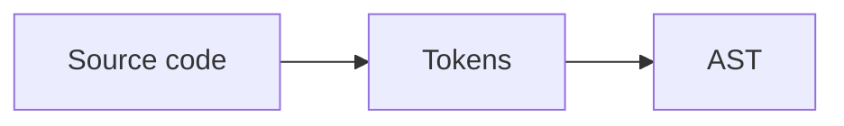

# Parsing & AST

The parsing stage includes lexing and parsing, but lexer has a pretty straightforward workflow and I don't want to discuss it so much.

What happens at this stage:

```mermaid
flowchart LR;
A[Source code] --> B[Tokens];
B --> C[AST];
```
